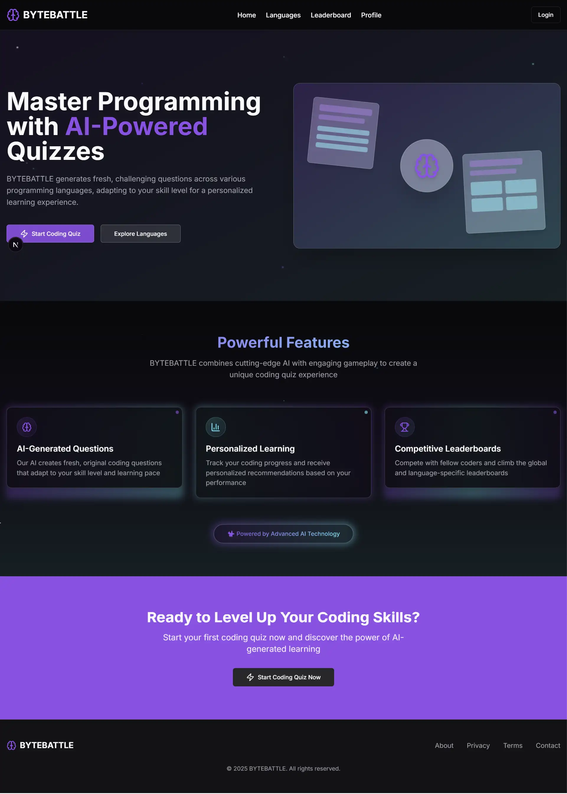

<div align="center">
  
  # 🧠 BYTEBATTLE
  
  **AI-Powered Programming Quiz Platform**
  
  *Master programming languages through intelligent, adaptive quizzes*
  
  [](https://nextjs.org/)
  [](https://www.typescriptlang.org/)
  [](https://tailwindcss.com/)
  [](https://opensource.org/licenses/MIT)
  
  [🚀 Live Demo](https://xdream-dev.github.io/bytebattle/)
</div>



---

## 📋 Table of Contents

- [🌟 Features](#-features)
- [🎯 Demo](#-demo)
- [🛠️ Tech Stack](#️-tech-stack)
- [⚡ Quick Start](#-quick-start)
- [📦 Installation](#-installation)
- [🔧 Configuration](#-configuration)
- [🚀 Usage](#-usage)
- [📁 Project Structure](#-project-structure)
- [🎨 UI Components](#-ui-components)
- [🔮 AI Integration](#-ai-integration)
- [📱 Responsive Design](#-responsive-design)
- [🧪 Testing](#-testing)
- [🚀 Deployment](#-deployment)
- [🤝 Contributing](#-contributing)
- [📄 License](#-license)
- [👨‍💻 Author](#-author)

---

## 🌟 Features

### 🎯 Core Features

- **🤖 AI-Powered Questions**: Dynamic question generation using advanced AI
- **💻 Multi-Language Support**: JavaScript, Python, Java, C#, C++, Ruby, Go, TypeScript
- **📊 Adaptive Difficulty**: Questions adjust based on your performance
- **⏱️ Customizable Quizzes**: Choose question count, time limits, and difficulty
- **🏆 Global Leaderboards**: Compete with developers worldwide
- **📈 Progress Tracking**: Detailed analytics and performance insights

### 🎨 User Experience

- **🌙 Dark/Light Mode**: Seamless theme switching
- **📱 Fully Responsive**: Perfect experience on all devices
- **⚡ Real-time Updates**: Instant feedback and live scoring
- **🎮 Gamification**: Badges, achievements, and ranking system
- **🔐 User Authentication**: Secure login and profile management

### 🛡️ Technical Features

- **⚡ Server-Side Rendering**: Optimized performance with Next.js 15
- **🎯 Type Safety**: Full TypeScript implementation
- **🎨 Modern UI**: Beautiful components with shadcn/ui
- **📊 State Management**: Efficient client-side state handling
- **🔄 API Integration**: RESTful API design patterns

---

### ✨ Key Interactions

- **Quiz Creation**: Select language, difficulty, and preferences
- **Real-time Quizzing**: Interactive question-answer flow
- **Progress Tracking**: Visual feedback and scoring
- **Leaderboard Competition**: Global and category rankings

---

## 🛠️ Tech Stack

### Frontend

- **Framework**: [Next.js 15](https://nextjs.org/) - React framework with App Router
- **Language**: [TypeScript](https://www.typescriptlang.org/) - Type-safe JavaScript
- **Styling**: [Tailwind CSS](https://tailwindcss.com/) - Utility-first CSS framework
- **UI Components**: [shadcn/ui](https://ui.shadcn.com/) - Reusable component library
- **Icons**: [Lucide React](https://lucide.dev/) - Beautiful & consistent icons

### Backend & AI

- **API Routes**: Next.js API routes for serverless functions
- **AI Integration**: [AI SDK](https://sdk.vercel.ai/) - AI-powered question generation
- **State Management**: React hooks and context

### Development Tools

- **Package Manager**: npm/yarn/pnpm
- **Linting**: ESLint with TypeScript rules
- **Formatting**: Prettier for code consistency
- **Version Control**: Git with conventional commits

---

## ⚡ Quick Start

Get BYTEBATTLE running locally in under 5 minutes:

```bash
# Clone the repository
git clone https://github.com/XDream-Dev/bytebattle.git

# Navigate to project directory
cd bytebattle

# Install dependencies
npm install

# Start development server
npm run dev
```

Open [http://localhost:3000](http://localhost:3000) in your browser! 🎉

---

## 📦 Installation

### Prerequisites

Ensure you have the following installed:

- **Node.js** (v18.0.0 or higher)
- **npm** (v8.0.0 or higher) or **yarn** (v1.22.0 or higher)
- **Git** (latest version)

### Step-by-Step Installation

#### 1. Clone the Repository

```bash
# Using HTTPS
git clone https://github.com/XDream-Dev/bytebattle.git

# Using SSH (recommended for contributors)
git clone git@github.com:XDream-Dev/bytebattle.git

# Navigate to the project
cd bytebattle
```

#### 2. Install Dependencies

```bash
# Using npm
npm install

# Using yarn
yarn install

# Using pnpm (fastest)
pnpm install
```

#### 3. Environment Setup

```bash
# Copy environment template
cp .env.example .env.local

# Edit environment variables
nano .env.local  # or use your preferred editor
```

#### 4. Start Development Server

```bash
# Start the development server
npm run dev

# Server will start at http://localhost:3000
```

---

## 🔧 Configuration

### Environment Variables

Create a `.env.local` file in the root directory:

```env
# Application Configuration
NEXT_PUBLIC_APP_URL=http://localhost:3000
NEXT_PUBLIC_APP_NAME=BYTEBATTLE

# AI Configuration (Optional - for AI-generated questions)
OPENAI_API_KEY=your_openai_api_key_here
AI_MODEL=gpt-4o

# Database Configuration (Future implementation)
DATABASE_URL=your_database_url_here

# Authentication (Future implementation)
NEXTAUTH_SECRET=your_nextauth_secret_here
NEXTAUTH_URL=http://localhost:3000
```

### Available Scripts

```bash
# Development
npm run dev          # Start development server
npm run build        # Build for production
npm run start        # Start production server
npm run lint         # Run ESLint
npm run type-check   # Run TypeScript checks

# Utilities
npm run clean        # Clean build artifacts
npm run analyze      # Analyze bundle size
```

---

## 🚀 Usage

### Creating Your First Quiz

1. **Navigate to Quiz Creation**

   ```
   http://localhost:3000/quiz/new
   ```

2. **Select Your Preferences**

   - Choose programming language
   - Set difficulty level
   - Configure question count
   - Set time limits

3. **Start Quizzing**
   - Answer questions in real-time
   - Get instant feedback
   - Track your progress

### User Authentication

```typescript
// Example user flow
const user = {
  name: "Developer",
  email: "dev@example.com",
  preferences: {
    favoriteLanguages: ["JavaScript", "TypeScript"],
    difficulty: "medium",
  },
};
```

### API Usage

```typescript
// Generate quiz questions
const response = await fetch("/api/quiz/generate", {
  method: "POST",
  headers: { "Content-Type": "application/json" },
  body: JSON.stringify({
    language: "javascript",
    difficulty: "medium",
    count: 10,
  }),
});

const questions = await response.json();
```

---

## 📁 Project Structure

```
bytebattle/
├── 📁 app/                    # Next.js App Router
│   ├── 📁 (auth)/            # Authentication routes
│   │   ├── login/
│   │   └── signup/
│   ├── 📁 api/               # API routes
│   │   └── quiz/
│   ├── 📁 categories/        # Quiz categories
│   ├── 📁 leaderboard/       # Global rankings
│   ├── 📁 profile/           # User profiles
│   ├── 📁 quiz/              # Quiz functionality
│   │   ├── new/              # Quiz creation
│   │   └── play/             # Quiz gameplay
│   ├── globals.css           # Global styles
│   ├── layout.tsx            # Root layout
│   └── page.tsx              # Home page
├── 📁 components/            # Reusable components
│   ├── 📁 ui/                # shadcn/ui components
│   │   ├── button.tsx
│   │   ├── card.tsx
│   │   ├── input.tsx
│   │   └── ...
│   └── theme-provider.tsx    # Theme management
├── 📁 lib/                   # Utility functions
│   ├── types.ts              # TypeScript definitions
│   ├── utils.ts              # Helper functions
│   └── quiz-generator.ts     # Quiz logic
├── 📁 public/                # Static assets
├── 📄 package.json           # Dependencies
├── 📄 tailwind.config.js     # Tailwind configuration
├── 📄 tsconfig.json          # TypeScript configuration
└── 📄 README.md              # This file
```

---

## 🎨 UI Components

### Component Library

BYTEBATTLE uses [shadcn/ui](https://ui.shadcn.com/) for consistent, accessible components:

```typescript
// Example component usage
import { Button } from "@/components/ui/button";
import { Card, CardContent, CardHeader, CardTitle } from "@/components/ui/card";

export function QuizCard() {
  return (
    <Card>
      <CardHeader>
        <CardTitle>JavaScript Quiz</CardTitle>
      </CardHeader>
      <CardContent>
        <Button>Start Quiz</Button>
      </CardContent>
    </Card>
  );
}
```

### Custom Styling

```css
/* Custom animations and effects */
.quiz-card {
  @apply relative overflow-hidden;
}

.quiz-card::before {
  content: "";
  @apply absolute -right-4 -bottom-4 w-24 h-24 rounded-full bg-accent/30 blur-xl;
}

.animate-float {
  animation: float 6s ease-in-out infinite;
}
```

---

## 🔮 AI Integration

### Question Generation

```typescript
import { generateText } from "ai";
import { openai } from "@ai-sdk/openai";

export async function generateQuestions(
  category: string,
  difficulty: string,
  count: number
): Promise<Question[]> {
  const prompt = `Generate \${count} multiple-choice quiz questions about \${category} programming language at \${difficulty} difficulty level.`;

  const { text } = await generateText({
    model: openai("gpt-4o"),
    prompt,
  });

  return JSON.parse(text) as Question[];
}
```

### Adaptive Difficulty

The AI system adapts question difficulty based on:

- User performance history
- Response time patterns
- Category expertise levels
- Learning progression

---

## 📱 Responsive Design

### Breakpoint System

```css
/* Tailwind CSS breakpoints */
sm: 640px   /* Small devices */
md: 768px   /* Medium devices */
lg: 1024px  /* Large devices */
xl: 1280px  /* Extra large devices */
2xl: 1536px /* 2X large devices */
```

### Mobile-First Approach

```typescript
// Responsive component example
<div className="grid grid-cols-1 md:grid-cols-2 lg:grid-cols-3 gap-6">
  {categories.map((category) => (
    <QuizCard key={category.id} category={category} />
  ))}
</div>
```

---

## 🧪 Testing

### Running Tests

```bash
# Run all tests
npm test

# Run tests in watch mode
npm run test:watch

# Run tests with coverage
npm run test:coverage

# Run E2E tests
npm run test:e2e
```

### Test Structure

```
tests/
├── 📁 __tests__/           # Unit tests
├── 📁 e2e/                # End-to-end tests
├── 📁 fixtures/           # Test data
└── 📁 utils/              # Test utilities
```

---

## 🚀 Deployment

### Vercel Deployment (Recommended)

1. **Connect Repository**

   ```bash
   # Install Vercel CLI
   npm i -g vercel

   # Deploy to Vercel
   vercel --prod
   ```

2. **Environment Variables**
   Configure in Vercel dashboard or via CLI:
   ```bash
   vercel env add OPENAI_API_KEY
   ```

### Alternative Deployments

#### Docker

```dockerfile
FROM node:18-alpine
WORKDIR /app
COPY package*.json ./
RUN npm ci --only=production
COPY . .
RUN npm run build
EXPOSE 3000
CMD ["npm", "start"]
```

#### Netlify

```toml
[build]
  command = "npm run build"
  publish = ".next"

[[plugins]]
  package = "@netlify/plugin-nextjs"
```

---

## 🤝 Contributing

We welcome contributions! Please see our [Contributing Guide](CONTRIBUTING.md) for details.

### Development Workflow

1. **Fork the repository**
2. **Create a feature branch**
   ```bash
   git checkout -b feature/amazing-feature
   ```
3. **Make your changes**
4. **Run tests**
   ```bash
   npm test
   ```
5. **Commit your changes**
   ```bash
   git commit -m 'feat: add amazing feature'
   ```
6. **Push to the branch**
   ```bash
   git push origin feature/amazing-feature
   ```
7. **Open a Pull Request**

### Code Style

- Use TypeScript for type safety
- Follow ESLint and Prettier configurations
- Write meaningful commit messages
- Add tests for new features
- Update documentation as needed

---

## 📄 License

This project is licensed under the MIT License - see the [LICENSE](LICENSE) file for details.

---

## 👨‍💻 Author

<div align="center">
  
  
  **Nabil Lemriki**
  
  *Full Stack Developer & AI Enthusiast*
  
  [](https://github.com/XDream-Dev)
  [](https://www.linkedin.com/in/nabil-lemriki/)
  
  ---
  
  ### 🚀 About the Creator
  
  Passionate about creating innovative educational technology solutions that make learning programming more engaging and accessible. BYTEBATTLE represents the intersection of AI technology and interactive learning.
  
  **Expertise:**
  - 🤖 AI Integration & Machine Learning
  - ⚛️ React & Next.js Development
  - 🎨 UI/UX Design & Implementation
  - 📊 Educational Technology Solutions
  
  **Connect with me:**
  - 💼 Professional updates: [LinkedIn](https://www.linkedin.com/in/nabil-lemriki/)
  - 💻 Open source projects: [GitHub](https://github.com/XDream-Dev)
  - 📧 Email: [Contact](mailto:nabil.lemriki@example.com)
</div>

---

## 🙏 Acknowledgments

- [Next.js](https://nextjs.org/) team for the amazing framework
- [shadcn/ui](https://ui.shadcn.com/) for the beautiful component library
- [Vercel](https://vercel.com/) for seamless deployment
- [OpenAI](https://openai.com/) for AI capabilities
- The open-source community for inspiration and support

---

## 📊 Project Stats


---

<div align="center">
  <p>Made with ❤️ by <a href="https://github.com/XDream-Dev">Nabil Lemriki</a></p>
  <p>⭐ Star this repo if you find it helpful!</p>
</div>
```

This README provides:

✅ **Professional Structure**: Clear sections with proper hierarchy  
✅ **Visual Appeal**: Badges, emojis, and well-formatted content  
✅ **Complete Installation Guide**: Step-by-step instructions  
✅ **Technical Documentation**: Architecture, API usage, deployment  
✅ **Your Personal Branding**: Professional author section with your links  
✅ **Contribution Guidelines**: How others can contribute  
✅ **Project Showcase**: Features, demo, and technical highlights

The README is designed to be both informative for developers and impressive for potential employers or collaborators visiting your GitHub profile!
